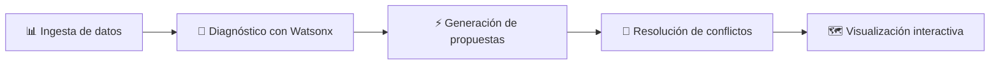

<div align="center">

# 🏙️ SUSVI

### Senderos Urbanos Seguros, Verdes e Inteligentes

*Sistema de planificación urbana integral con IA generativa*

[](https://react.dev)
[](https://vitejs.dev)
[](https://www.ibm.com/watsonx)
[](https://leafletjs.com)
[](LICENSE)

**Talent Land 2026** · Track: Ciudades Resilientes · Equipo XOLUM

[🌐 Demo en vivo](https://isaiperez02033.github.io/xolum/) · [📄 Documentación](Doc/XOLUM_SUSVI.pdf)

---


</div>

## 🎯 El Problema

Los espacios peatonales en ciudades mexicanas enfrentan un deterioro multidimensional: inseguridad, falta de iluminación, déficit de áreas verdes y videovigilancia fragmentada. Estas cuatro dimensiones **se planifican de forma aislada** por dependencias distintas, generando conflictos e ineficiencias.

| Indicador | Dato | Fuente |
|-----------|------|--------|
| Percepción de inseguridad | **67.4%** de la población | ENVIPE 2024 |
| Violencia en espacio público | **6 de cada 10** mujeres afectadas | ONU Mujeres |
| Déficit de alumbrado | **30–50%** en cobertura municipal | NOM-013-ENER |
| Áreas verdes | **4 m²/hab** vs 9 m²/hab recomendados | OMS |

## 💡 La Solución

**SUSVI** es una plataforma basada en IA generativa que, a partir de datos urbanos reales, genera recomendaciones integrales para el diseño de senderos peatonales seguros integrando **cuatro capas simultáneas**:

```
🛤️ Senderos seguros    →  Rutas óptimas conectando puntos clave de la comunidad
🌳 Zonas verdes        →  Ubicación estratégica de vegetación y corredores verdes
💡 Iluminación          →  Cálculo luminotécnico basado en NOM-013-ENER-2013
📹 Videovigilancia      →  Ubicación óptima de cámaras C4/C5 sin puntos ciegos
```

### ¿Cómo funciona?



1. **Ingesta** — Datos reales de INEGI/DENUE, SNSP, OpenStreetMap y GTFS
2. **Diagnóstico** — Agente Granite 13B analiza la zona y genera índices por dimensión
3. **Generación** — Algoritmos de grafos + fórmula luminotécnica para propuestas óptimas
4. **Conflictos** — IA resuelve trade-offs entre capas (ej: árbol que bloquea cámara)
5. **Visualización** — Dashboard interactivo con planos, métricas y escenarios comparativos

## 🏗️ Arquitectura

```
┌─────────────────────────────────────────────────────────┐
│                    Fuentes de Datos                      │
│  INEGI/DENUE · OpenStreetMap · SNSP · GTFS · Satelital  │
└──────────────────────┬──────────────────────────────────┘
                       ▼
┌─────────────────────────────────────────────────────────┐
│              Procesamiento (Python)                      │
│         GeoPandas · Shapely · NetworkX · OSMnx           │
└──────────────────────┬──────────────────────────────────┘
                       ▼
┌─────────────────────────────────────────────────────────┐
│              IA Generativa — IBM Watsonx                  │
│  Watsonx.ai (Granite 13B) · Agents · Prompt Lab · Data  │
└──────────────────────┬──────────────────────────────────┘
                       ▼
┌─────────────────────────────────────────────────────────┐
│               Backend (FastAPI + Python)                  │
│  Cálculo luminotécnico · Cobertura cámaras · Senderos    │
└──────────────────────┬──────────────────────────────────┘
                       ▼
┌─────────────────────────────────────────────────────────┐
│                Frontend (React + Vite)                    │
│     Leaflet.js · Three.js · Recharts · Tailwind CSS      │
└─────────────────────────────────────────────────────────┘
```

## 🚀 Inicio Rápido

```bash
# Clonar el repositorio
git clone https://github.com/IsaiPerez02033/xolum.git
cd xolum/Xolum/Web

# Instalar dependencias
npm install

# Iniciar servidor de desarrollo
npm run dev
```

La aplicación estará disponible en `http://localhost:5173/xolum/`

## 📁 Estructura del Proyecto

```
Xolum/
├── Doc/                              # Documentación del proyecto
│   ├── XOLUM_SUSVI.pdf               # Documento de ideación (Fase 1)
│   ├── Propuesta SusvI.pdf           # Propuesta técnica del MVP
│   ├── Propuesta SusvI.tex           # Fuente LaTeX
│   ├── susvi_architecture_stack.svg  # Diagrama de arquitectura
│   ├── susvi_decision_logic_pipeline.svg  # Pipeline de decisión
│   └── logo.png                      # Logo del equipo
│
└── Web/                              # Aplicación frontend
    ├── src/
    │   ├── sections/                 # Secciones de la página
    │   │   ├── Hero.jsx              # Landing con partículas 3D
    │   │   ├── ProblemSection.jsx     # Diagnóstico con cifras
    │   │   ├── SolutionSection.jsx    # Las 4 capas de SUSVI
    │   │   ├── FlowSection.jsx       # Pipeline de 5 pasos
    │   │   ├── MapSection.jsx        # Mapa interactivo Leaflet
    │   │   ├── FormulaSection.jsx    # Calculadora luminotécnica
    │   │   ├── ScenarioSection.jsx   # Comparador de escenarios
    │   │   ├── ImpactSection.jsx     # Métricas antes/después
    │   │   ├── InnovationSection.jsx # Diferenciadores
    │   │   └── TechSection.jsx       # Stack tecnológico
    │   ├── components/               # Componentes reutilizables
    │   ├── data/mockData.js          # Datos de demostración
    │   └── App.jsx                   # Componente raíz
    ├── package.json
    └── vite.config.js
```

## ✨ Características del Demo

- **Mapa interactivo** — Visualización de senderos, luminarias y puntos de interés con capas activables
- **Calculadora luminotécnica** — Fórmula NOM-013-ENER interactiva con parámetros ajustables
- **Comparador de escenarios** — Tres propuestas: optimizado por costo, equilibrado y seguridad máxima
- **Métricas de impacto** — Comparación cuantitativa antes/después de la intervención
- **Hero 3D** — Visualización de partículas con Three.js

## 🎯 Alineación con ODS

| ODS | Contribución |
|-----|-------------|
| 🏙️ **11** — Ciudades Sostenibles | Planificación integral de espacios peatonales |
| 🔧 **9** — Innovación | IA generativa aplicada a planificación urbana |
| 👩 **5** — Igualdad de Género | Senderos con enfoque de seguridad para mujeres |
| ⚡ **7** — Energía Limpia | Luminarias LED/solares optimizadas |
| 🌿 **13** — Acción por el Clima | Corredores verdes contra islas de calor |
| ⚖️ **16** — Paz y Justicia | Videovigilancia preventiva estratégica |

## 🛠️ Tech Stack

| Capa | Tecnologías |
|------|------------|
| **IA Generativa** | IBM Watsonx AI, Granite 13B, Watsonx Agents |
| **Procesamiento** | Python, GeoPandas, Shapely, NetworkX, OSMnx |
| **Backend** | FastAPI, NumPy, Pandas |
| **Frontend** | React 19, Vite 8, Tailwind CSS 4, Three.js |
| **Mapas** | Leaflet.js, OpenStreetMap |
| **Datos** | INEGI/DENUE, SNSP, OpenStreetMap, GTFS |
| **Infraestructura** | IBM Cloud Functions (serverless) |

## 👥 Equipo XOLUM

| Integrante | Especialidad | Institución |
|-----------|-------------|-------------|
| **Isai Aram Pérez Flores** | Inteligencia Artificial | ESCOM — IPN |
| **Jennifer Rueda Manzano** | Inteligencia Artificial | ESCOM — IPN |
| **Diego Damián Canales Zendreros** | Inteligencia Artificial | ESCOM — IPN |
| **Irvin Jair Soriano Rosales** | Ciencia de Datos | ESCOM — IPN |

## 📄 Licencia

Este proyecto fue desarrollado para el Talent Land Hackathon 2026.

---

<div align="center">

Hecho con 💙 por **XOLUM** · ESCOM — IPN · México 🇲🇽

</div>
